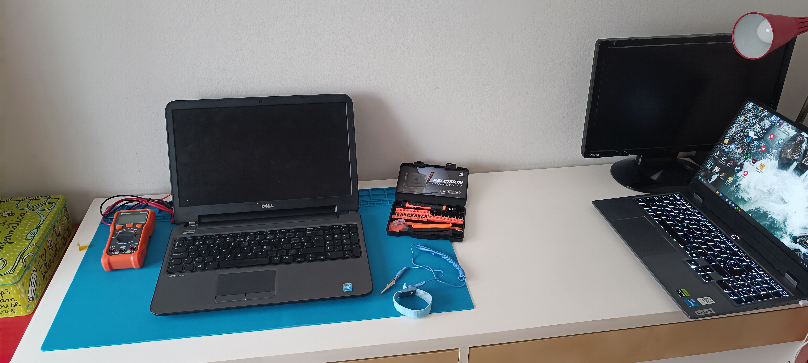
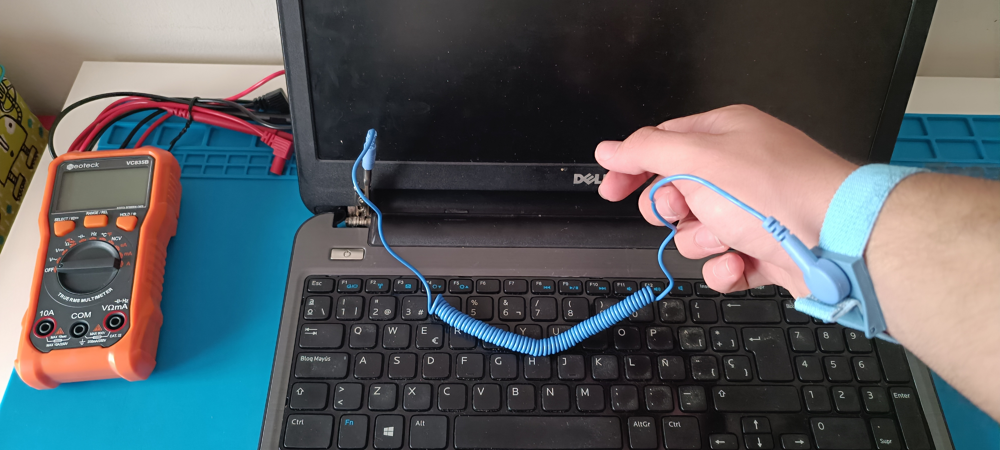
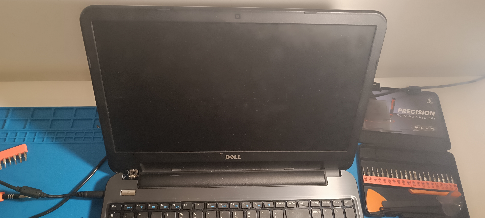
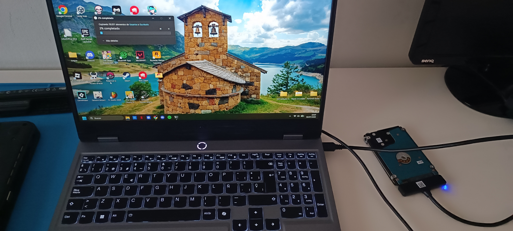
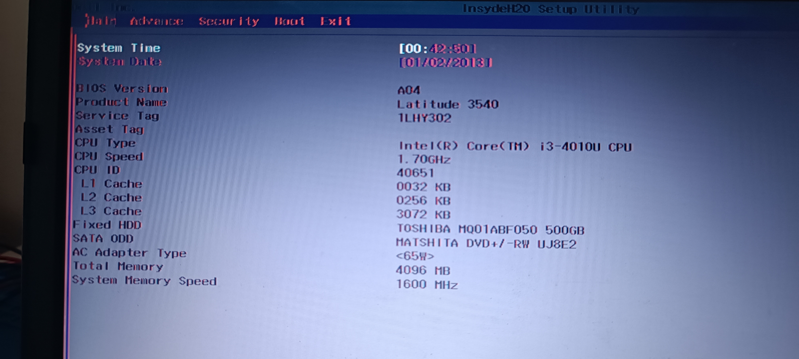
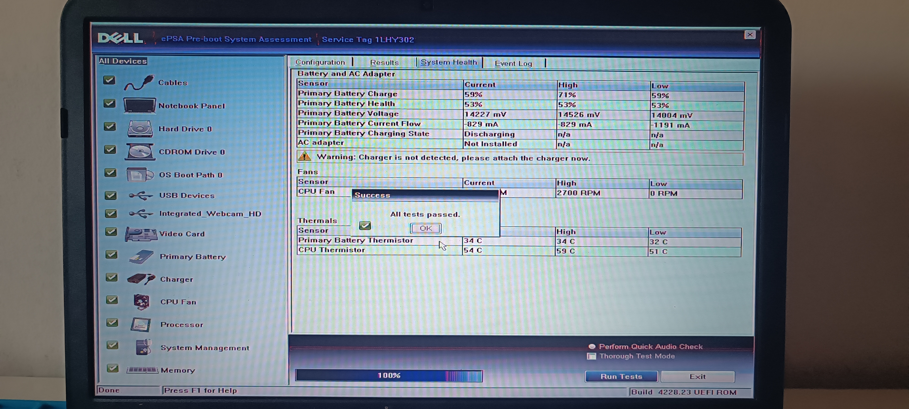
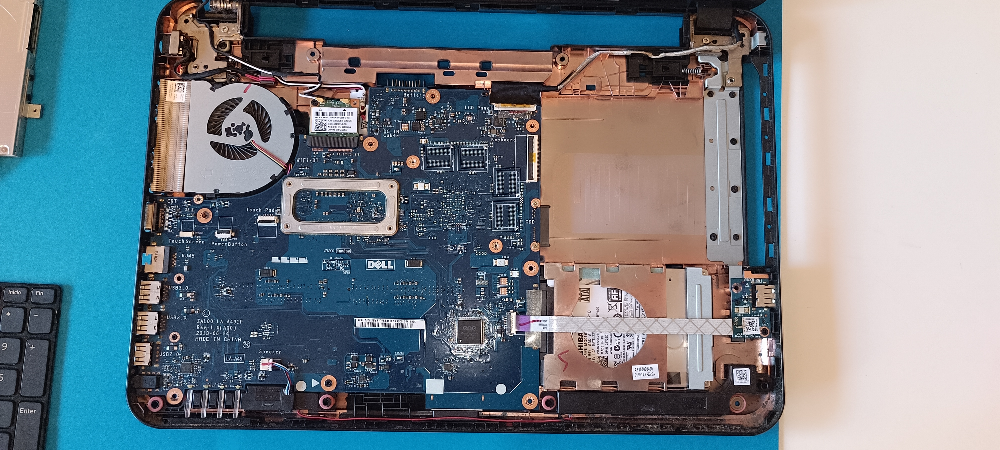
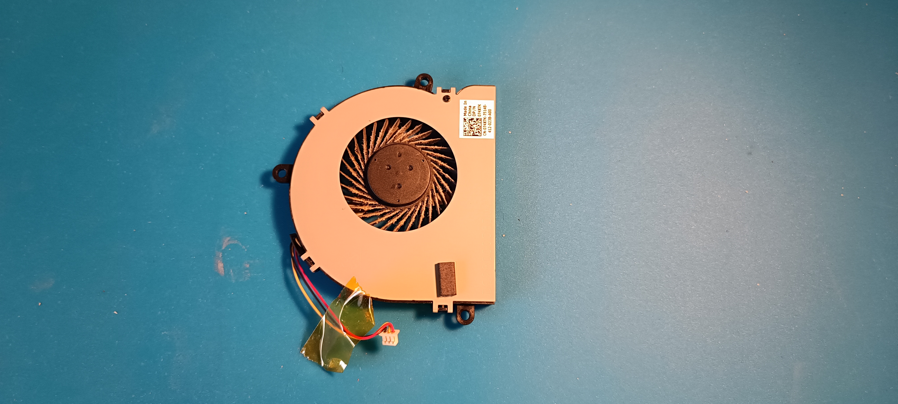
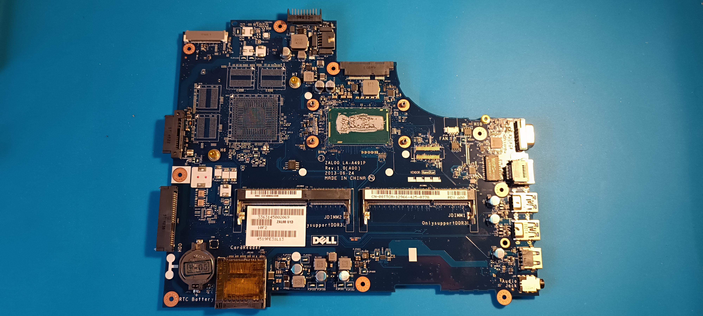

# Informe d'Auditoria Tècnica i Pla de Viabilitat de Maquinari
## Model: Dell Latitude 3540 (Sèrie Professional)

Benvingut/da al meu repositori de portafoli professional. Aquest projecte documenta un cas real d'auditoria tècnica de maquinari. L'objectiu és d'exhibir competències sòlides en diagnòstic de sistemes a baix nivell, detecció d'anomalies elèctriques per interferència electromagnètica (EMI), salvaguarda extractiva d'informació, anàlisi termomecànic (*Thermal Throttling*) i generació d'informes de viabilitat estructurats.

---

## 1. Preparació de l'Entorn i Seguretat ESD
Totes les intervencions s'han realitzat sota un protocol estricte de seguretat electromecànica per salvaguardar la integritat dels components microelectrònics de la placa base:
*   **Banc de Treball:** Superfície de treball completament desinfectada, lliure de pols i aïllada.
*   **Protecció contra descàrregues:** Ús de polsera antiestàtica fixada a una presa de terra funcional com a mesura preventiva obligatòria abans de fer qualsevol tipus d'obertura física de l'equip.

  
  

---

## 2. Bloc d'Inspecció Estètica i Exterior
Abans de procedir al diagnòstic intern, es realitza un examen visual de l'estat de conservació del xassís i els perifèrics de contacte directe:
*   **Estat General de l'Estructura:** El portàtil es presenta en bon estat estructural general, sense esquerdes crítiques a la carcassa plàstica ni deformacions per impactes greus. La tapa superior i inferior es troben en molt bones condicions, sense rascades o ratllades importants d'ús.
*   **Higiene del Terminal:** Es detecta una acumulació evident de brutícia a la pantalla (empremtes i pols ambiental acumulada) i restes de pols entre les tecles del terminal que requereixen un sanejament estètic.
*   **Teclat i Desgast:** Les tecles mostren el desgast cosmètic típic de l'ús continuat (brillantor per fricció en les tecles de més freqüència d'escriptura), de tota manera mantenen el recorregut mecànic correcte.
*   **Mecanisme de Bisagres (Frontisses):** Manca la tapa plàstica de protecció d'una de les frontisses. Tot i que l'absència d'aquest embellidor és un defecte estètic, el mecanisme intern de subjecció i obertura de la pantalla opera amb la resistència adequada i de forma segura.

  

---

## 3. Bloc de Salvaguarda de Dades (Còpia Externa)
Davant la fallada d'arrencada el sistema de l'equip, s'aplica el protocol professional de protecció del actiu més valuós de l'usuari: la seva informació.
*   **Aïllament del Component:** Es desconnecta qualsevol font d'energia, s'extreu el disc dur mecànic (HDD 2.5" SATA) i es connecta a una estació de treball externa mitjançant un adaptador independent.
*   **Resultat:** S'ha completat amb èxit un **Backup integral de les dades del client**, protegint els arxius contra qualsevol alteració elèctrica o lògica durant el procés de diagnòstic i estrès tèrmic.

  

---

## 4. Bloc de Diagnòstic Lògic i de Baix Nivell (Pre-Boot)
L'equip presentava un bloqueig crític en l'encesa ordinària que impedia carregar el Sistema Operatiu (SO), per la qual cosa es va aplicar un protocol d'aïllament a nivell de firmware (ROM):
*   **Símptoma lògic:** Rendiment extremadament lent des del primer segon d'encesa. El sistema operatiu amfitrió es congela a la pantalla d'inici i no es carrega en memòria RAM. 
*   **Restricció i Eines Descartades:** Al no carregar el SO, s'ha hagut de descartar l'ús de programari clàssic de diagnòstic avançat en espai d'usuari com **AIDA64**, **HWiNFO64** o **HWMonitor** per a l'anàlisi de sensors, **OCCT** per a proves d'estrès, o **CrystalDiskInfo** per avaluar la salut de la línia d'emmagatzematge.
*   **Solució tècnica aplicada:**
    1.  **Auditoria de BIOS (F2):** Reconeixement correcte de la freqüència base de la CPU i mapping del banc de memòria RAM. Es confirma el reconeixement de l'arquitectura de memòria instal·lada (mòduls DDR3L) i la seva correcta detecció durant el POST elèctric, descartant una fallada de línies de control d'adreces a la placa base. Tot i així, la navegació pels menús començava a ralentitzar-se progressivament a causa de l'estrès tèrmic acumulat.
    2.  **Test d'Estrès ePSA de Dell (F12):** Execució de l'eina de diagnòstic nadiu integrat en placa. El test confirma que no hi ha danys catastròfics ni curtcircuits a la placa mare o memòries. Addicionalment, es va superar el test interactiu cromàtic del panell LCD (*Display Panel Test* / *BIST*), ratificant la total integritat de la pantalla: absència de píxels defectuosos (*dead pixels*), zero distorsions i un inversor de retroil·luminació completament stable.

  
  

---

## 5. Bloc d'Anàlisi Elèctrica i Electromagnètica (EMI)
Es detecta un comportament erràtic de la interfície d'usuari directament lligat a la línia d'entrada d'alimentació:
*   **Sota Alimentació AC (Carregador connectat):** El cursor del ratolí presenta desplaçaments i clics fantasmagòrics autònoms, fent impossible el seu control.
*   **Sota Alimentació DC (Funcionament amb bateria):** En desconnectar físicament el carregador de l'equip, la fletxa del ratolí recupera a l'acte la seva estabilitat i precisió des del Touchpad.
*   **Conclusió d'enginyeria:** El sensor del Touchpad i el seu bus de dades lògic estan sans. L'anomalia es deu a **Soroll Elèctric (Interferència Electromagnètica - EMI)** provocat per un rissat de corrent alt (*ripple*) provinent d'un carregador defectuós o una pèrdua d'aïllament a la presa de terra del connector *DC-In*.

---

## 6. Bloc d'Inspecció Interna i Termomecànica (Open-Box)
Després de retirar la bateria de seguretat i extreure la carcassa inferior, es va inspeccionar el nucli de l'arquitectura de refrigeració, confirmant les següents troballes tèrmiques:
*   **Obstrucció de Ventilació Activa:** El ventilador tangencial i les reixetes del dissipador estan completament saturats per una capa sòlida de pols i borrissol. L'expulsió de l'aire calent està pràcticament bloquejada al 100%.
*   **Degradació del Compost Tèrmic:** La pasta tèrmica conductora original entre el dau de la CPU i el difusor de coure es troba **totalment deshidratada, cristal·litzada i trencada**.
*   **Diagnòstic de Causa Arrel (*Thermal Throttling*):** Les esquerdes en la pasta seca funcionen com un aïllant tèrmic. A causa de la mínima massa tèrmica del nucli de silici de la CPU, la total manca de transferència cap al coure i l'obstrucció del ventilador fan que el processador assoleixi temperatures crítiques properes als 100°C en pocs segons des de l'encesa. 
*   **Mecanisme de Control:** Aquesta pujada instantània activa el senyal de maquinari d'autoprotecció d'Intel anomenat **PROCHOT (Processor Hot)**, obligant el processador a reduir la seva freqüència de rellotge al mínim absolut (*Throttling*) per evitar la seva destrucció. Aquest fenomen, observable pel fet que el ventilador es revoluciona al 100% immediatament després d'encendre l'equip, explica de manera directa la degradació de rendiment que impedeix carregar el Sistema Operatiu.

  
  
  

---

## 7. Recomanacions de Millora i Manteniment Proposat
Per recuperar l'equip i retornar-li una experiència d'ús fluida, s'estableix el següent pla d'actuació tècnica:
1.  **Intervenció Termomecànica i Higiene:** Netejar el ventilador amb alcohol isopropílic (99%) i aire comprimit. Eliminar el residu de pasta antiga i aplicar compost nou d'alta conductivitat (ex. *Arctic MX-4*). Realitzar un sanejament estètic exterior de teclat i pantalla.
2.  **Sanejament Elèctric:** Substituir el carregador actual per una unitat original Dell certificada per neutralitzar el soroll elèctric del Touchpad.
3.  **Actualització de Maquinari i Emmagatzematge:** Substituir el disc dur mecànic de 2.5" actual per un **disc d'estat sòlid (SSD) de 2.5" SATA** (tipus *Crucial BX500* o *Kingston A400*) i fer una instal·lació neta del Sistema Operatiu des de zero. Això eliminarà el coll d'ampolla i restablirà l'estabilitat del sistema.
4.  **Ampliación de Memòria RAM:** Es recomana parametritzar els bancs ocupats i, en cas de comptar només amb 4GB de RAM, ampliar a 8GB o 16GB DDR3L per optimitzar la multitasca sota entorns moderns.

---

## 8. Valoració d'Usos Reals (Post-Reparació)
Un cop aplicat el pla d'acció, aquesta arquitectura (Intel de 4a Generació) oferirà un rendiment excel·lent per a:
*   **Ofimàtica i Educació:** Treball fluid amb documents (Word, Excel, PDF) i suites d'estudi.
*   **Teletreball i Navegació:** Gestió de navegadors amb múltiples pestanyes i aplicacions de videotrucada.
*   **Consum Multimèdia:** Streaming de vídeo en alta definició (Full HD 1080p) estable i sense talls.
*   **Administració de Sistemes i Codi:** Entorn lleuger per a aprenentatge de programació, execució de sistemes operatius Linux o control de repositoris a GitHub.
